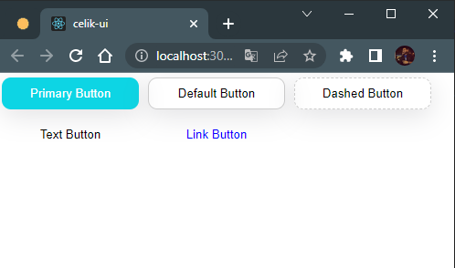
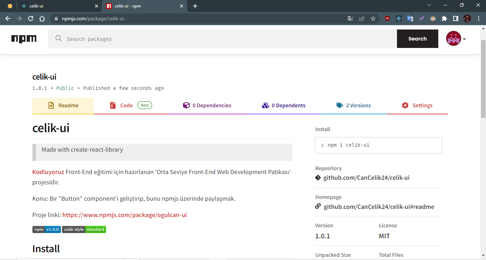

# celik-ui

> Made with create-react-library

[Kodluyoruz](https://www.kodluyoruz.org/)  Front-End eğitimi için hazırlanan 'Orta Seviye Front-End Web Development Patikası' projesidir. 

Konu: Bir "Button" component'i geliştirip, bunu npmjs üzerinde paylaşmak.

Proje linki: https://www.npmjs.com/package/ogulcan-ui

Görseller:




[](https://www.npmjs.com/package/celik-ui) [](https://standardjs.com)

## Install

```bash
npm install --save celik-ui
```

## Usage

```jsx
import React, { Component } from 'react'

import MyComponent from 'celik-ui'
import 'celik-ui/dist/index.css'

class Example extends Component {
  render() {
    return <MyComponent />
  }
}
```

## License

MIT © [CanCelik24](https://github.com/CanCelik24)
